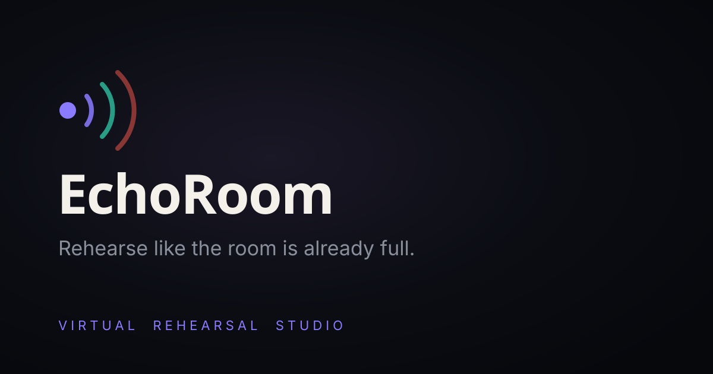

# EchoRoom

**Rehearse like the room is already full.**

EchoRoom is a virtual rehearsal studio for musicians, speakers and performers.
Step into the booth, perform in front of a simulated audience, get live feedback
on timing and confidence, record every take, and watch yourself improve.

This repo is the marketing/experience front end: a real-time 3D recording booth
rendered with **Three.js (WebGPU + TSL)** behind an expertly designed React
product UI — logo and nav, a live session HUD, and a DAW-style transport that
actually drives the scene.



## Highlights

- **WebGPU renderer, authored in TSL.** The booth uses `three/webgpu` with the
  Three Shading Language (`three/tsl`) for every material — procedural acoustic
  foam, satin wood, brushed metal, glass and emissive signage — plus a TSL
  bloom post-processing pass. It runs on WebGPU where available and falls back
  to WebGL2 automatically.
- **A real recording booth.** Acoustic-foam treated walls (instanced pyramids),
  a large-diaphragm condenser on a shock mount with pop filter and boom stand,
  studio headphones, a glowing ON AIR sign, a holographic level meter, dust in
  the light, and a cinematic key / stage-light rig with soft shadows.
- **The UI drives the 3D.** Toggling stage lighting, hitting record, or changing
  the audience size in the transport eases the real scene — lights, the ON AIR
  sign and the meter all respond.
- **Premium product chrome.** Custom cursor, glass panels, a live session HUD
  (confidence / timing / audience / score), film grain and vignette, and a
  staged intro reveal.

## Stack

- React 18 + Vite 5
- three.js `r180` — `three/webgpu` renderer, `three/tsl` materials, TSL bloom
- Space Grotesk + Inter (self-hosted via `@fontsource`)
- No global state lib — a tiny `studio` store bridges the UI and the scene

## Run it

```bash
npm install
npm run dev      # http://localhost:5173
npm run build    # production build to dist/
npm run preview  # serve the production build
```

A modern browser is required (WebGPU preferred, WebGL2 fallback).

## Architecture

```
src/
  App.jsx                 # composition: 3D stage + UI layer + overlays
  ui/                     # Nav, Hero, SessionHUD, Transport, Cursor, Preloader, Logo, icons
  lib/studio.js           # shared control surface (UI <-> scene)
  three/
    BoothCanvas.jsx       # React bridge that owns the canvas + Booth lifecycle
    booth/
      Booth.js            # renderer, camera, post, control easing, render loop
      env.js              # procedural studio environment (PMREM)
      materials.js        # TSL material library
      foam.js room.js     # acoustic foam walls + room shell
      microphone.js       # the hero: condenser, shock mount, pop filter, stand
      headphones.js onair.js eq.js lights.js motes.js
```

The React layer owns the DOM UI; a single imperative `Booth` owns the WebGPU
scene. They communicate only through `lib/studio.js`, so neither has to know
about the other's internals.

## Verifying the render

`scripts/screenshot.mjs` drives headless Chromium (via `puppeteer-core` +
`@sparticuz/chromium`) to capture the running app — used to verify the scene in
a real browser engine during development. Append `?bare` to the URL to hide the
UI and inspect the 3D set on its own.

```bash
node scripts/screenshot.mjs "http://localhost:5173/" out.png 1440 900
```
